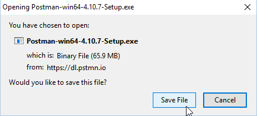

 

Update: May 5, 2017

# Integrating with NetSuite Using ICS Workshop Prerequisites

## 3rd Party Testing Tools

### Install Postman

We will use Postman to test an ICS REST Web Service integration.

If you don't already have Postman installed on your workstation, you'll need to install it.

To install Postman for testing the ICS integration follow these instructions:

- Download the Postman OpenSource application for your desktop/laptop from the URL: <https://www.getpostman.com/>

- Save the download file to a temporary directory on your workstation.

- Run the installer from the temporary directory

- Postman will launch after installation is complete.

- Full instructions for installing Postman on your workstation are provided here: <https://www.getpostman.com/docs/install_native> 

---

## Supported Browsers

Most modern browsers including Chrome, Safari, Internet Explorer, Edge and Firefox are supported.

