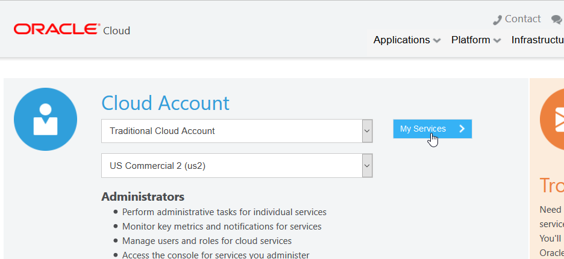
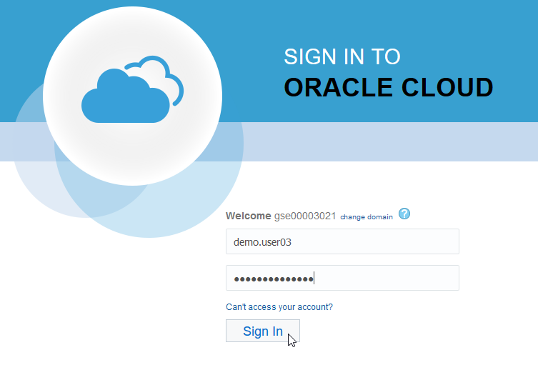
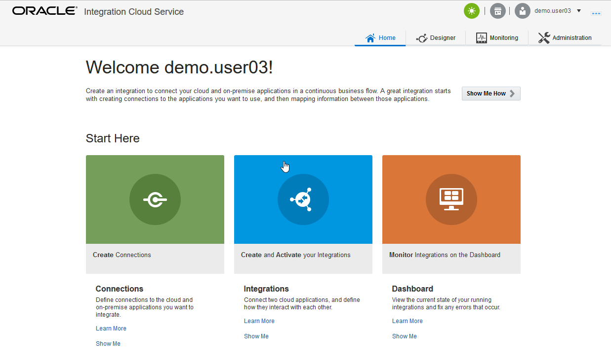
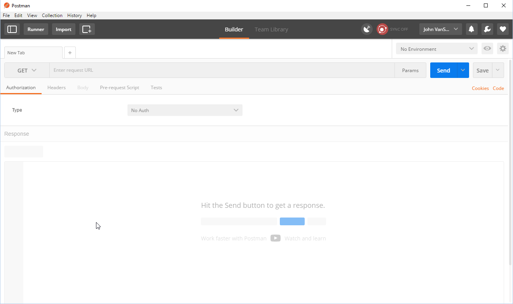

Updated: May 5, 2017

# Lab 200 - Integrating with NetSuite using ICS

## Introduction

This is the second lab in the **Integrating with NetSuite using ICS Workshop**. 

In this lab, you will learn how to create an integration with NetSuite using a basic orchestration in ICS. 

The ICS integration that we'll be building is shown in the following picture:


Here is a description of what is happening with this integration:

Postman will be used to test the exposed REST service endpoint of the ICS integration called *UserXX NetSuite Query* (where XX will be 00 -> 10).  This integration has 2 connections.  The incoming message is received by the incoming *UserXX REST* REST Connection.  The *UserXX NetSuite Query* orchestration makes a query into the NetSuite SaaS application using the *UserXX NetSuite* connection to get details of the NetSuite business objects.  After the query is made, a few fields from the result are returned to the calling client, Postman.

## Objectives

- Learn how to create ICS REST and NetSuite Connections
- Learn how to create an ICS Orchestration using the ICS Adapters
- Learn how to test the ICS integration using Postman

## Required Artifacts

- The following lab and an Oracle Public Cloud account that will be supplied by your instructor.
- A NetSuite sandbox environment that will be supplied by your instructor.
- Postman will need to be installed for ICS integration testing - see "Prerequisites" section of the workshop for details

## Part 1: Create the ICS Connections

### **1.1**: Login to your Oracle Cloud account

---

**1.1.1** From your browser (Firefox or Chrome recommended) go to the following URL:
<https://cloud.oracle.com>

**1.1.2** Click Sign In in the upper right hand corner of the browser
**IMPORTANT** - Under My Services, change Data Center to `US Commercial 2 (us2)` and click on Sign In to My Services



**1.1.3** If your identity domain is not already set, enter it and click **Go**

**NOTE:** the **Identity Domain** values will be given to you from your instructor.

  

**1.1.4** Once your Identity Domain is set, enter your `User Name` and `Password` and click **Sign In**

***NOTE:*** the **User Name and Password** values will be given to you by your instructor.

  

**1.1.5** You will be presented with a Dashboard displaying the various cloud services available to this account.

**NOTE:** The Cloud Services dashboard is intended to be used by the *Cloud Administrator* user role.  The Cloud Administrator is responsible for adding users, service instances, and monitoring usage of the Oracle cloud service account.  Developers and Operations roles will go directly to the service console link, not through the service dashboard.


**1.1.6**  To get to the Integration Cloud Service (ICS) service console where you will work on developing the integration, click on the `hamburger` icon next to the *Integration* service, then click on the `View Details` link.


**1.1.7**  Select the `Open Service Console` link to go to the ICS Service Console.  

  

**1.1.8**  You will now be presented with the ICS Service Console from which you will be performing the rest of this workshop lab.

  

### **1.2**: Create the Source Connection using the REST Adapter

---

**1.2.1** Select the `Connections` graphic in the designer portal

 

**1.2.2** Click on **New Connection**

 

**1.2.3** Select the **REST** Connection, by either doing a search, or by scrolling down to the **REST** connection, then click on the **Select** button of the **REST** connection.


**1.2.4** Fill in the information for the new connection 

- **Name:** Enter in the form of _UserXX REST_ where XX is the number in your allocated user.
- **Role:** Select _Trigger_ since we going to use the connection as a trigger to start the integration

Note that the **Identifier** will automatically be created based on the **Name** you entered.

**1.2.5** Click **Create**

 

**1.2.6** We will keep the default of `Basic Authentication` in the *Configure Security* section. 

**1.2.7** At the top of the connection configuration screen, Click on the **Test** button to test the connection.  Selecting the *Test* button is part of the connection setup process - because this is an inbound REST Trigger there isn't anything to test so it will automatically complete.

Note how the progress indicator will go from 33% to 100% after the connection tests successfully.


**1.2.8** Click on the **Save** button in the upper right corner of the connection configuration screen.

 

**1.2.9** Click on the **Exit Connection** button in the upper right of the connection configuration screen.


Your new REST connection appears in the list of configured connections and is even marked as **New** !

 

### **1.3**: Create the Target Connection using the NetSuite Adapter

---

**1.3.1** Click on **New Connection** again

 

**1.3.2** Select the **Oracle NetSuite** Connection, by either doing a search, or by scrolling down to the **Oracle NetSuite** connection, then click on the **Select** button of the **Oracle NetSuite** connection.


**1.3.3** Fill in the information for the new connection:

- **Name:** Enter in the form of _UserXX NetSuite_ where XX is the number in your allocated user.
- **Role:** Leave the default setting of _Invoke_ since we going to call the connection as an invocation from the integration

Note that the **Identifier** will automatically be created based on the **Name** you entered.

**1.3.4** Click **Create**

 

**1.3.5** Click the **Configure Connectivity** button

 

**1.3.6** Enter the WSDL value for the NetSuite APIs in the *Connection Properties*:

- **WSDL URL:** - `https://webservices.netsuite.com/wsdl/v2016_2_0/netsuite.wsdl` - this is the NetSuite WSDL URL for the 16.2.0 release

 

**1.3.7** Next scroll down in the Connection Configuration page and select the **Configure Security** button.

 

**1.3.8** Enter the following attributes for the NetSuite connection security values.
  
*Note:* Your workshop instructor will tell you if these need to be changed.

- **Email Address:** - `john.vansant@oracle.com` 
- **Account:** - `TSTDRV1412347`
- **Role:** - `18`
- **Password:** - This will be given out by your instructor 
- **Application Id** - `1065764F-EA42-4AC9-B437-71EB8E7036FB`

**1.3.9** Click on the **OK** button to save the credentials.


**1.3.10** At the top of the connection configuration screen, Click on the **Test** button to test the connection.


Note how the progress indicator will go from 85% to 100% after the connection tests successfully.

 

**1.3.11** Click on the **Save** button in the upper right corner of the connection configuration screen.

 

**1.3.12** Click on the **Exit Connection** button in the upper right of the connection configuration screen.


Your new NetSuite connection appears in the list of configured connections and is even marked as **New** !

**Note** how the icon for the connection is different between the REST and NetSuite connectors.

 

## Part 2: Create the ICS Integration

### **2.1**: Create an Orchestration Style Integration

---

**2.1.1** On the left-hand navigation of the Connections screen select the "Integrations" link


**2.1.2** Select the **New Integration** button in the top of the Integrations screen


**2.1.3** In the **Create Integration - Select a Style/Pattern**, select the **Orchestration** style.  We want to use this because our integration may have multiple invocations to the NetSuite system at a later point - the **Basic Map Data** style only has a single target service invocation as well as additional invocations for data enrichment of the payload before the target invocation call is made.


**2.1.4** Fill in the information for the new orchestration

- **What triggers this integration?:** Select the radio button for `Application event or business object`.  Note that integrations can be scheduled to run at specific times if the `Schedule` trigger type is selected.
- **What do you want to call your integration?:** Enter the name in the form of _UserXX NetSuite Query_ where XX is the number in your allocated user.
- **Identifier:** Accept the default - this value will be generated based on the name you enter.
- **Version:** Accept the default - if you want to clone and create newer versions later, you can change to a higher version than **01.00.0000** which is the default.

After you've filled in the information, select the **Create** button


**2.1.5** Observe the design canvas for the new integration.  (The various features of the ICS designer were covered in lab 100 **Exploring ICS** earlier in this workshop)


**2.1.6** Create the Trigger for the orchestration. This integration will have a REST endpoint as defined when we created the **UserXX REST** connector earlier.

Expand the list of REST Triggers by clicking on the **REST(X)** link (where `X` will be the number of REST connections in the ICS instance - this will vary depending on how many others are running the workshop together).

Click and drag your REST connection identified by your assigned user (ie: `UserXX REST`) over to the **Start** target.  

(Note: After you click and start dragging your connection, the `Triggers` connection tray on the left hand side of the designer will become hidden)


**2.1.7** Drop your connection onto the large *Plus Sign* inside the *Start* circle.


**2.1.8** Fill in the required values on **Basic Info** page, and click **Next >**

- **What do you want to call your endpoint?** _NetSuiteQuery_
- **What is the endpoint's relative resource URI** _/NetSuiteQuery_
- **What action does the endpoint perform?** _POST_
- **Configure a request payload for this endpoint** _Checked_
- **Configure for this endpoint to receive a response** _Checked_


**2.1.9** Select the *JSON Sample* radio button, and click on *<<< inline >>>* to enter a sample JSON request payload.

Note 1: The **<<< inline >>>** link will not appear until you select the **JSON Sample** radio button.

Note 2: The *JSON* radio button will automatically be selected in **type of payload** after you enter the inline payload sample.


**2.1.10** Copy then Paste the following JSON into the **Enter Sample JSON**, then click **Ok**

Since we are looking up Vendor Payments in NetSuite, we will pass in the Id for a record to query.

```javascript
{
"VendorPaymentId":"string"
}
```


**2.1.11** Click on *Next >* to move on to the **Response** page

**2.1.12** In the **Configure the Response Payload** screen, select *JSON Sample*, and click on *<<< inline >>>* to enter sample JSON

Note 1: The **<<< inline >>>** link will not appear until you select the **JSON Sample** radio button.

Note 2: The *JSON* radio button will automatically be selected in **type of payload** after you enter the inline payload sample.


**2.1.13** Copy then Paste the following JSON into the **Enter Sample JSON**, and click **Ok**

```javascript
{
"Payee":"string",
"CheckNumber":"string",
"CheckAmount":"string",
"CheckPostingDate":"string",
"AccountBalance":"string"
}
```


**2.1.14** Back on the Response Page,  click *Next >*


**2.1.15** After reviewing the trigger details, click **Done**.


**2.1.16** The ICS design canvas will now show the Trigger named **NetSuiteQuery** along with the mapping and return nodes of the same name.

**2.1.17** It is a good practice to periodically save your work.  Select the *Save* button in the upper right corner.


**2.1.18** Next, we will add the service invocation to NetSuite for the Query.  Select the *Invokes* menu on the left-hand navigation of the design canvas.

Expand the list of NetSuite Triggers by clicking on the *NetSuite(X)* link (where `X` will be the number of NetSuite connections in the ICS instance - this will vary depending on how many others are running the workshop together).

Click and drag your NetSuite connection identified by your assigned user (ie: *UserXX NetSuite*) just below the `NetSuiteQuery` trigger.  

(Note: After you click and start dragging your connection, the `Triggers` connection tray on the left hand side of the designer will become hidden)


**2.1.19** Drop the `UserXX NetSuite` connection on top of the *Plus Sign* signifying the drop-zone target.


**2.1.20** Fill in the required values on **Basic Info** page, and click *Next >*

- **What do you want to call your endpoint?** _InvokeNetSuite_


**2.1.21** On the **Operations** page, select the **Operation Type** of _Basic_ and the operation _Get_

**2.1.22** Enter _Vendor_ in the **Filter by object name** textbox, then select _VendorPayment_ in the list of NetSuite Business Objects


**2.1.23** Next, shuttle it over to the selected objects by using the _right shuttle arrow_


**2.1.24** On the **Summary** page, observe the settings for the NetSuite invocation, then select the _Done_ button.


**2.1.25** Now that the new invocation has been added, the orchestration may be too long to all fit on the design canvas.  To make it fit, select the _Zoom to Fit_ button in the row of design canvas tools in the upper right.


**2.1.26** Now that the REST Trigger and service invocation to NetSuite have been configured in the orchestration, it is time to move on to creating the mappings.

**2.1.27** Select the _Save_ button in the upper right to save your work before creating the mappings.


### **2.2**: Create the NetSuite Invocation Mapping

---

**2.2.1** Click on the *mapping symbol* for the _InvokeNetSuite_ mapping - this will bring up 3 icons for activities we can do to the mapping.  

**2.2.2** Click on the _pencil icon_ to edit the mapping.

Note: You can also upload an external XSLT file for this mapping that you've created external to ICS if desired by clicking the little `upload` icon.  You can also delete the mapping with the little `trash can` icon.


**2.2.3** Edit the mapping by clicking on the little circle to the right of the _VendorPaymentId_ source variable and then drag it on top of the little circle just to the left of the _InternalId_ target variable.


**2.2.4** As described in the lab 100 ICS overview, this map could be tested by selecting the **Test** button in the upper right.  We aren't going to test this mapping because it is so simple.

**2.2.5** After completing the mapping, save it by clicking on the *Save* icon in the upper right of the design window


**2.2.6** Exit the mapping editor by clicking on the *< Exit Mapper* button in the upper left.


**2.2.7** Save the progress of your orchestration by clicking on the *Save* icon in the upper right of the design window


### **2.3**: Create the Return Payload Mapping

---

**2.3.1** Click on the *mapping symbol* for the _NetSuiteQuery_ mapping - again, this will bring up 3 icons for activities we can do to the mapping.  

**2.3.2** Click on the _pencil icon_ to edit the mapping.


**2.3.3** For this lab, we are going to map only some of the values returned from the NetSuite VendorPayment business object.

The fields we are going to map are highlighted in the NetSuite Bill Payment screenshot below:


**2.3.4** To find out how the actual variable display name maps to the business object attribute, we can reference the NetSuite documentation for VendorPayment which can be found here: [http://www.netsuite.com/help/helpcenter/en\_US/srbrowser/Browser2016\_2/schema/record/vendorpayment.html](http://www.netsuite.com/help/helpcenter/en_US/srbrowser/Browser2016_2/schema/record/vendorpayment.html)

In the documentation, the *Label* column is what shows up in the NetSuite webpage, and the *Name* column is what the business object attribute is called.

Below is a table showing the VendorPayment *NetSuite UI Labels* with their corresponding *Business Object Source Variable Names* and the *Target Variable Names* they need to be mapped to:

<table border=2, border-width=2>
  <tr>
    <th  style="background-color: #008000">NetSuite UI Label</th>
    <th  style="background-color: #008000">Business Object Source Variable Name</th>
    <th  style="background-color: #008000">Target Variable Name</th>
  </tr>
  <tr><td>PAYEE</td><td>entity -> name</td><td>Payee</td></tr>
  <tr><td>CHECK #</td><td>tranId</td><td>CheckNumber</td></tr>
  <tr><td>AMOUNT</td><td>total</td><td>CheckAmount</td></tr>
  <tr><td>DATE</td><td>tranDate</td><td>CheckPostingDate</td></tr>
  <tr><td>BALANCE</td><td>balance</td><td>AccountBalance</td></tr>
</table>

**2.3.5** The VendorPayment business object is quite large with lots of fields.  It can be difficult to scroll through the list of attributes looking for the one you want to map.

To make finding attributes in a large payload easier, the ICS mapping tool has a search box where the attribute can be looked up.

**2.3.6** TYpe the attribute name _entity_ in the search box, then click on the little magnifying glass icon and it will pop that attribute to the top of the Source variable list:


**2.3.7** Expand the _entity_ attribute and then map the _name_ variable over to the Target variable _Payee_


**2.3.8** For each of the values in the table above, search for the Source variable and map it onto the Target Variable Name shown in the table.

**2.3.9** When you are complete with the other 4 mapppings, the editor should match the screenshot below.

**2.3.10** Click on the _Save_ button to save the mapping.


**2.3.11** Select the _< Exit Mapper_ button to go back to the design canvas.


**2.3.12** Save the progress of your orchestration by clicking on the *Save* icon in the upper right of the design window


### **2.4**: Add Tracking Variables for the Integration

---

**2.4.1:**	Open the “Tracking” editor

We want to add the *VendorPaymentId* we just mapped as a `Business Identifier`.  Business Identifiers enable runtime tracking on messages.  These identifiers will be saved in ICS’s monitoring tab for each instance of the integration that is run.

**2.4.2** Click on the `Tracking` button next to the *Save* button to bring up the business identifier editor.


**2.4.3:**	The `Business Identifiers For Tracking` editor will be opened up

**2.4.4** Click on the *VendorPaymentId* variable in the Source variable section.  The editor will show the metadata for this variable such as type, path, etc.

**2.4.5** Next, click on the *Shuttle Icon* to move the `VendorPaymentId` variable over to be a new `Tracking Field`.

**2.4.6** Observe that the `VendorPaymentId` variable has now been added as a `Tracking Field`.  The source variable name is also added as the `Tracking Name` by default and spaces automatically added to the camel-case humps – since `Vendor Payment Id` means something and is suitable for people to read in the monitoring tab we’ll keep it. If the comment variable was something random like `C2EF`, we would want to change it and give it a human-readable tracking name.

**2.4.7** Select the *Done* button now that the new `Business Identifier` has been added.


**2.4.8** Once again, click on the *Save* button to save the tracking changes


**2.4.9** This integration is now complete, select the *< Exit Integration* button


We now need to activate (deploy) the new integration so it can be tested.

### **2.5**: Activate the Integration

---

**2.5.1** Click on the *Activate* switch/slider on the right of the `UserXX NetSuite Query` integration.


**2.5.2** The `Activate Integration?` dialog will be displayed

**2.5.3** Select the *Enable tracing* button since this isn’t a production deployment.  This checkbox will tell ICS that the payloads for each instance of the integration will be saved in the logfiles as explored in the first part of this lab earlier.

**2.5.4** Now select the *Activate* button to begin activation of the integration.


**2.5.5** The progress bar of the integration activation will move across the `Activate Integration?` dialog box.

**2.5.6** Once the integration is activated you will see that the activation slider now is colored green with a checkmark in it.


### **2.6**:	Check the Service Endpoint

---

**2.6.1** A message will appear on the top of the ICS Designer Portal indicating that the integration activation was successful.  The URI for the service endpoint will also be displayed.

**2.6.2** Click on the URI link so we can ensure that this integration has an available service endpoint.


**2.6.3** If this is the first time you have have opened an ICS URI in the browser, you _may_ be prompted to enter your username/password for ICS in a pop-up login window.


**2.6.3** The URI for you new ICS integration will now be displayed in your browser.

**2.6.4** Copy the REST Service URI into your copy buffer so we can test it in the next lab section.


**2.6.5** Now that we have built and activated an integration and copied it's service endpoint, we can test it with some sample data to make sure it works.

## Part 3: Test the ICS Integration

---

### **3.1**: Testing Using PostMan

**3.1.1** Open PostMan.  If you don't already have this installed, follow the instructions provided in the **Prerequisites** section of this workshop.



**3.1.2** In the **URI** text box on the top, paste the REST Service link you copied earlier from ICS. 

**3.1.3** _Important_: Replace the string `metadata` with the service endpoint `NetSuiteQuery`

**3.1.4** Select the REST Verb *POST* from the selection box to the left of the **URI** text box.


**3.1.5** Next we need to add the authorization credentials so ICS will allow the request from PostMan.  ICS uses basic username/password authentication.

**3.1.6** Click on the *Authorization* tab just under the **POST** action set in the last step.

**3.1.7** Select *Basic Auth* from the picklist of various types of authorization methods.


**3.1.9** Enter your *ICS credentials*, then click on the *Update Request* button to add the **Authorization** header to the REST payload.  After selecting the button, you'll notice that a header is added by the *(1)* just to the right of the **Headers** tab.


**3.1.10** We now need to add the request payload to send to ICS.  

**3.1.11** Select the *Body* tab just to the right of the **Headers*.

**3.1.12** Select the *raw* data type, then select  *JSON (application/json)* from the picklist of input data Content-Types.


**3.1.13** Enter the JSON payload into the raw data textbox as shown below.

```javascript
{
"VendorPaymentId":"210"
}
```

**3.1.14** After entering the JSON payload, click on the blue _Send_ button to the right of the REST API URI to send the input data over to ICS..


**3.1.15** Just below the raw input data textarea, the results of the ICS integration call will be displayed.  

The return payload of the ICS integration will show the values which were looked up in the NetSuite API call.  Here is an example of what the return data might look like (this will vary depending on the VendorPaymentId passed in).

```javascript
{
   "Payee": "Pacific Bell Telephone",
   "CheckNumber": "2009",
   "CheckAmount": "1368.75",
   "CheckPostingDate": "2012-05-20T00:00:00.000-07:00",
   "AccountBalance": "4739927.21"
}
```

**3.1.16** An example of the output is shown here and in the following screenshot:


You have now tested an end-to-end integration to NetSuite using Oracle Integration Cloud Service.

Congratulations!  Unless you'd also like to try testing with SoapUI, you have now completed Lab 200 - _Integrating with NetSuite using ICS_
